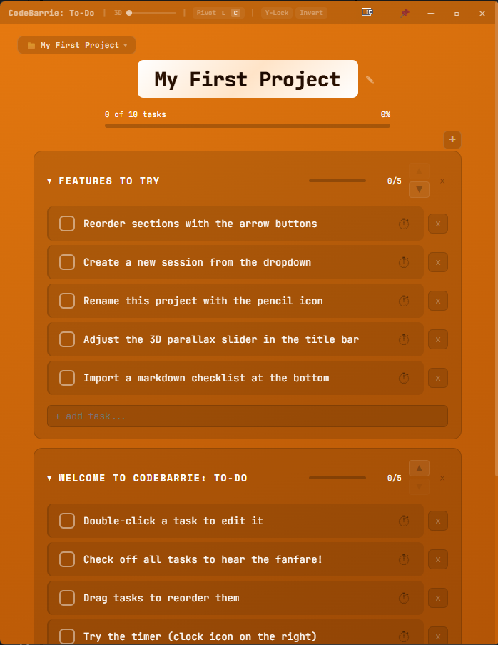

# CodeBarrie: To-Do

A desktop to-do list app that makes checking things off feel *really* good.

Built with [Tauri](https://tauri.app/) + React. Runs on Windows, macOS, and Linux.



## What Makes It Different

- **Musical check-offs** — Each task plays a note from an ascending pentatonic scale. The further you get, the higher the pitch. Complete everything and a Final Fantasy-style victory fanfare plays.
- **Cinematic section reorder** — Move a section and watch it lift, glide, land with a screen shake, and burst confetti from all four sides.
- **Task drag-and-drop with soul pull** — Drag a task and its ghost floats out while neighboring tasks ripple away from the drop point on impact.
- **3D parallax** — Every card tilts and shifts based on your mouse position. Adjustable intensity, pivot point, and axis lock from the title bar.
- **Countdown timers** — Set a timer on any task (5m, 15m, 25m, 60m, or custom). A depleting bar shows time remaining with auto-inverting text color.
- **Always-on-top pin** — One-click pin button in the title bar to float the app above everything else while you work.
- **Sessions** — Multiple independent projects. Switch between them, rename them, delete them.
- **Confetti & celebrations** — Task completion toasts, section-clear bursts, and a full-screen confetti mega-celebration when you finish everything.

## Install

### Download (Easiest)

Grab the latest installer from [Releases](https://github.com/CodeBarrie/codebarrie-todo/releases):
- **Windows** — `.msi` installer
- **Linux** — `.deb` package or `.AppImage`

### Build from Source

**Prerequisites:**
- [Node.js](https://nodejs.org/) 18+
- [Rust](https://rustup.rs/)
- Linux only: system dependencies (see below)

```bash
git clone https://github.com/CodeBarrie/codebarrie-todo.git
cd codebarrie-todo
npm install
npx tauri build
```

The installer will be in `src-tauri/target/release/bundle/`.

#### Linux System Dependencies (Ubuntu/Debian)

```bash
sudo apt install libwebkit2gtk-4.1-dev build-essential curl wget \
  libssl-dev libgtk-3-dev libayatana-appindicator3-dev librsvg2-dev
```

### Development

```bash
npm install
npx tauri dev
```

## First Launch

The app comes with a built-in walkthrough project called **"My First Project"** that guides you through every feature. Check off the tasks to try them out.

## Tech

- **Frontend:** React 19, zero UI libraries — all animations, drag-and-drop, confetti, and sounds are hand-rolled
- **Desktop:** Tauri 2 (Rust) with custom frameless window
- **Audio:** Web Audio API synthesized tones (no audio files)
- **Storage:** localStorage with per-session isolation
- **Single file UI:** Everything lives in `src/App.jsx`

## License

MIT
